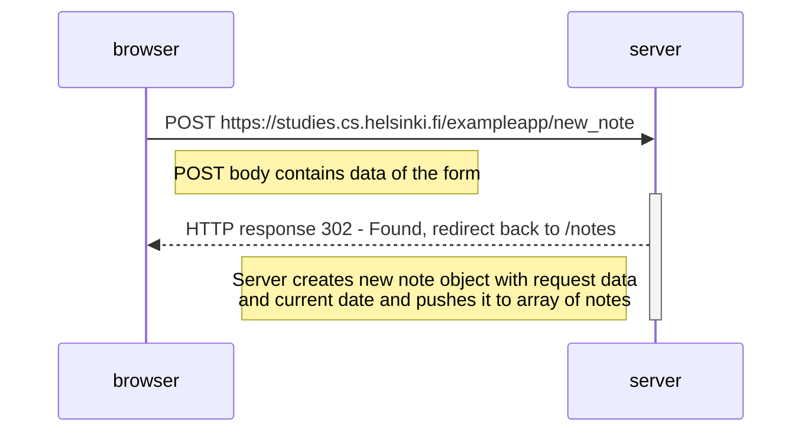

```mermaid
sequenceDiagram

    participant browser
    participant server


    browser->>server: POST https://studies.cs.helsinki.fi/exampleapp/new_note
    Note right of browser: POST body contains data of the form
    activate server
    server-->>browser: HTTP response 302 - Found, redirect back to /notes
    Note left of server: Server creates new note object with request data <br> and current date and pushes it to array of notes
    deactivate server


```
